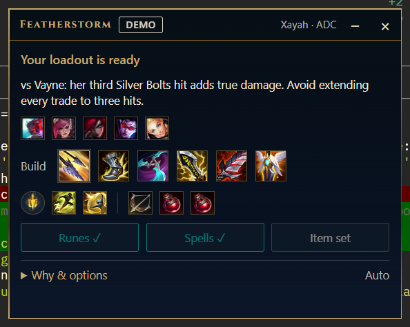
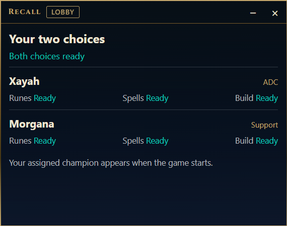

# Recall

A small always-on-top panel for League of Legends that tells you **what to buy next,
what it costs with the items you already hold, and why**. It prepares your runes, spells
and shop item set in champion select, then follows the game and updates the
recommendation as the enemy team's items become visible.

Recall reads only what the League client and the in-game Live Client Data API already
show you. It never touches memory, packets, or anything hidden, and it never plays for you.

*Recall was called Featherstorm until September 2026.*

<p>
  
  
</p>

## What it does

- **One recommendation at a time.** The next item, the component to buy right now, the
  remaining price, and a one-line reason. "Why & options" is there if you want it.
- **Builds from real data, not hand-written defaults.** Starting items, core path, boots,
  runes, spells and skill order come from what players of your champion and role run on
  the current patch (op.gg's champion API, cached locally). If your champion has no data
  for your assigned role, the same champion's most-played role is used and clearly labelled.
- **Shop-legal purchasing.** Component credit, exact combine prices, six-slot capacity,
  item families that exclude each other, Magical Footwear, support and jungle requirements,
  Swiftplay's shop rules. When you cannot afford the next item, it says how much you are short.
- **Situational adjustments you can see.** Anti-heal against a healer, a cleanse against a
  verified suppression, armor or magic resist against what the enemy actually built. Nothing
  changes for reasons the panel cannot state.
- **Champion-select and Swiftplay preparation.** Rune page, summoner spells and an in-shop
  item set are imported for you; in Swiftplay both of your choices are prepared before you queue.
- **Honest states.** Stale data, unknown modes, or a missing build pauses the advice instead
  of guessing. A short post-game recap shows the decisions; it never grades you.

## Getting started (Windows)

There is no installer yet; Recall is built from source. You need the Rust toolchain with the
MSVC target, Visual Studio C++ Build Tools, and WebView2 (already present on Windows 11).

```bash
git clone https://github.com/matteso1/recall.git
cd recall
cargo build --manifest-path overlay/Cargo.toml --release -p recall
overlay/target/release/recall.exe
```

The project is developed from WSL with the build running on the Windows side; the scripts in
`scripts/` (`overlay-build.sh`, `overlay-run.sh`, `overlay-probe.sh`) do that. See
[docs/notes/dev-setup.md](docs/notes/dev-setup.md).

To have Recall start and stop with the League client (no admin rights; a hidden watcher in your
Startup folder):

```bash
scripts/autostart-install.sh          # install and start the watcher; `remove` undoes it, `status` shows it
```

Then:

1. Start League. Recall appears a few seconds later and says **ready** while you are in the client
   (without the watcher, launch it yourself with `scripts/overlay-run.sh`).
2. Pick a champion. Runes, spells and the item set are imported when the pick locks; the panel
   shows the build path and the matchup notes. Turn any of the imports off in **Why & options**.
3. In game, buy what the panel says when you recall, or pin a different target. Your own
   purchases are always respected; nothing is ever sold.
4. In **Swiftplay**, open Recall in the lobby and wait for both choices to read **Ready** before
   you queue. Its champion select lasts one second, so preparation has to happen beforehand.

Settings (auto-import switches, data region and tier, saved position), caches, logs and the
decision journal live in `%LOCALAPPDATA%\Recall`.

## Modes and limits

Supported: Summoner's Rift (draft, blind, ranked), Swiftplay, Practice Tool. ARAM, Arena and
unknown modes pause recommendations rather than reuse Rift builds.

Recall never substitutes another champion's data. A small sample is shown as weak evidence.
Skill-point guidance is off for Aphelios, Udyr, Jayce, Elise, Nidalee and Karma until their
levelling is modelled. There is no wave-state inference, cooldown tracking, positioning advice
or trained win-probability model; the scoring weights are explicit, reviewable heuristics.

## Riot policy and privacy

Recall uses two local interfaces Riot provides for this purpose: the League Client API
(authenticated with the client's own lockfile) and the Live Client Data API. From them it reads
your gold, inventory, abilities, the visible rosters and scoreboard, and the game time.

It does not read process memory, capture packets, inject into the game, infer hidden positions,
enemy gold or cooldowns, or automate any gameplay. The only things it writes to your account
are rune pages and item sets named `Recall <champion> <role>`, which it also reuses and replaces;
personal pages are never edited or deleted. Nothing leaves your machine except requests for
public patch data and public build statistics.

Recall isn't endorsed by Riot Games and doesn't reflect the views or opinions of Riot Games or
anyone officially involved in producing or managing Riot Games properties. Riot Games and
League of Legends are trademarks or registered trademarks of Riot Games, Inc.

## Roadmap

- macOS support (the brain is portable; the window shell, screenshots and build scripts are Windows-only today).
- A packaged installer and signed release builds.
- More modes as their shops are verified (ARAM first).

Open an issue if you want to help with any of these.

## Development

Layout: `overlay/core` is the platform-independent brain (Rust), `overlay/src-tauri` is the
Windows window shell, `overlay/ui` is the panel (plain HTML, CSS, JS). `m0/` holds the original
stdlib-only Python probes for the local APIs, still used for capturing fixtures. The design doc is
[docs/design.md](docs/design.md); decisions and findings are in [docs/notes](docs/notes).

```bash
cargo test --manifest-path overlay/Cargo.toml --locked -p recall-core
cargo clippy --manifest-path overlay/Cargo.toml --locked -p recall-core --all-targets -- -D warnings
cargo test --manifest-path tests/runtime/Cargo.toml --target-dir overlay/target --locked
cargo clippy --manifest-path tests/runtime/Cargo.toml --target-dir overlay/target --locked --all-targets -- -D warnings
python3 -m unittest discover -s m0/tests -v
node --check overlay/ui/app.js
cd tests/ui && npm ci && npx playwright install --with-deps chromium && npm test
```

Browser tests render real serialized plans from the Rust core and mock only the window bridge.
Nothing in the test suites contacts League or the network.

Offline replay checks every recorded state of a captured game for legality:

```bash
cargo run --manifest-path overlay/Cargo.toml --locked -p recall-core --bin replay -- --fixtures
cargo run --manifest-path overlay/Cargo.toml --locked -p recall-core --bin replay -- \
  --session m0/tests/fixtures/captured \
  --items m0/tests/fixtures/item_subset.json \
  --champions m0/tests/fixtures/champion_subset.json \
  --aggregate m0/tests/fixtures/opgg_xayah_adc.json
```

Headless checks of the built executable: `recall.exe --probe --champion Irelia --role jungle --swiftplay`
plans a request against the real cache with no client or game; `recall.exe --demo champselect|ingame`
shows the panel with staged data and imports nothing.

## License

[MIT](LICENSE).
